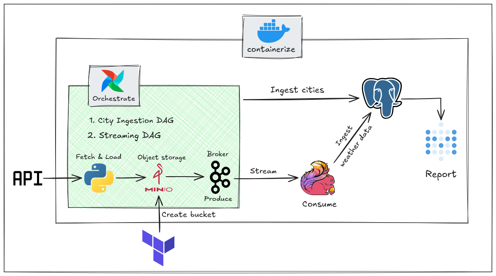

# Real-Time Weather Pipeline

A real-time weather data pipeline that demonstrates modern data engineering best practices by orchestrating weather data collection from the Open-Meteo API,
persisting raw data to object storage, streaming through Apache Kafka, and processing with Apache Flink into PostgreSQL for analytics.
The pipeline leverages Apache Airflow for workflow orchestration, includes infrastructure-as-code with Terraform,
and provides visualization through Metabase dashboards. Built entirely with Docker Compose for easy local development and deployment.

## Architecture



## Tech Stack

| Component              | Technology              |
| ---------------------- | ----------------------- |
| Orchestration          | Apache Airflow          |
| Message Broker         | Apache Kafka            |
| Stream Processing      | Apache Flink            |
| Object Storage         | MinIO (S3-compatible)   |
| Metadata DB & OLAP     | PostgreSQL              |
| Infrastructure as Code | Terraform               |
| Visualization          | Metabase                |
| Containerization       | Docker & Docker Compose |

## Quick Start

### Prerequisites

- Git
- Docker & Docker Compose
- `just` command runner (A better `make`)
- Terraform

### Setup

1. Clone the repository and navigate to the project directory:

```bash
git clone <repository-url>
cd realtime-weather-pipeline
```

2. Start the services using `just`:

```bash
# Using just (recommended)
just up

# Or using docker compose directly
docker compose up -d
```

> [!NOTE]
> I will be using `just` for all commands in this README, but you can achieve the same results by looking in `justfile` to see the equivalent commands.

## Web UIs

| Service       | Port | URL                   |
| ------------- | ---- | --------------------- |
| Airflow UI    | 8080 | http://localhost:8080 |
| Flink UI      | 5432 | http://localhost:8082 |
| Kafka UI      | 8083 | http://localhost:8083 |
| MinIO Console | 9001 | http://localhost:9001 |
| Metabase      | 3000 | http://localhost:3000 |

3. Create the MinIO bucket for storing weather data:

```bash
# initialize terraform
just init
# create the bucket
just apply
```

4. MinIO Setup for Airflow

To enable Airflow to communicate with MinIO instance, follow these steps:

    1.  Navigate to your Airflow web UI (typically `http://localhost:8080`).
    2.  In the side menu, go to **Admin** -> **Connections**.
    3.  Click the **+ (plus)** icon to add a new connection.
    4.  Fill in the following details:
        - **Connection Id:** `minio_conn`
        - **Connection Type:** `Amazon Web Services`
        - AWS Access Key ID: `mioadmin`
        - AWS Secret Access Key: `mioadmin`
        - **Extra Fields JSON:** add `{ "endpoint_url": "http://minio:9000" }`
        - **Save** the connection.

5. Start the Airflow DAGs:

From the Airflow UI, navigate to the **DAGs** tab, and toggle the switches to enable the `ingest_cities_dag` first and
then `streaming_dag`. This will start the data ingestion and streaming processes.

6. Visualize Data in Metabase:

- Access the Metabase UI at `http://localhost:3000`.
- Follow the setup instructions to connect to the PostgreSQL database (host: `postgres`, port: `5432`, username: `postgres`, password: `password`).
- Create a new dashboard and add questions to visualize the weather data stored in PostgreSQL.

## Default Credentials

| Service    | Username | Password |
| ---------- | -------- | -------- |
| Airflow    | admin    | -        |
| MinIO      | mioadmin | mioadmin |
| PostgreSQL | airflow  | airflow  |

To get the Airflow admin password, you can run:

```bash
# Password is frequently changed for security, so check the generated file
docker exec airflow cat simple_auth_manager_passwords.json.generated
```

## Project Structure

```
├── assets/                     # Static assets
│   └── pipeline.png            # Architecture diagram image
├── airflow/                    # Airflow orchestration
│   ├── .env.airflow            # Environment variables for Airflow
│   ├── compose.yml             # Docker compose for Airflow services
│   ├── Dockerfile              # Custom Airflow image build
│   ├── requirements.txt        # Python dependencies for Airflow
│   └── dags/                   # Airflow DAG definitions
│       ├── ingest_cities_dag.py  # DAG for ingesting city data into PostgreSQL
│       └── streaming_dag.py      # DAG for fetching weather data and sending to Kafka
├── flink/                      # Apache Flink stream processing
│   ├── .env.flink              # Environment variables for Flink
│   ├── .python-version         # Python version specification
│   ├── compose.yml             # Docker compose for Flink services
│   ├── Dockerfile              # Custom Flink image build
│   ├── flink-config.yaml       # Flink configuration
│   ├── producer.py             # Kafka producer for testing
│   ├── pyproject.toml          # Python project dependencies
│   ├── pyproject.flink.toml    # Flink-specific dependencies
│   ├── uv.lock                 # Locked dependency versions
│   ├── src/                    # Flink source code
│   │   └── consumer_job.py     # Kafka consumer that processes weather data
│   └── .venv/                  # Virtual environment
├── kafka/                      # Apache Kafka message broker
│   └── compose.yml             # Docker compose for Kafka services
├── minio/                      # MinIO object storage (S3-compatible)
│   ├── .env.minio              # Environment variables for MinIO
│   └── compose.yml             # Docker compose for MinIO services
├── postgres/                   # PostgreSQL database
│   ├── compose.yml             # Docker compose for PostgreSQL
│   ├── init-db/                # Database initialization scripts
│   │   └── weather-init.sql    # Weather data tables schema
│   └── metadata-init/          # Metadata initialization scripts
│       ├── airflow-init.sql    # Airflow metadata tables
│       └── metabase-init.sql   # Metabase configuration
├── metabase/                   # Metabase BI/visualization tool
│   └── compose.yml             # Docker compose for Metabase
├── terraform/                  # Infrastructure as Code
│   ├── main.tf                 # Terraform configuration for MinIO bucket
│   └── .terraform.lock.hcl     # Terraform lock file
├── justfile                    # Command runner shortcuts (alternative to Make)
└── compose.yml                 # Main Docker compose file for all services
```

## Pipeline Flow

1. **Airflow DAGs**:
   - fetches cities information from `simplemaps.com` and ingests it into PostgreSQL
   - fetches weather data for the cities from Open-Meteo API every 15 minutes
2. Raw JSON is stored in **MinIO** (weather-bucket, landing/ prefix)
3. Data is produced to **Kafka** (weather-topic)
4. Flink consume, transform and ingest the data into PostgreSQL

## Clean Up

To Clean and remove all services and volumes just run:

```bash
# this will remove all containers, networks, and volumes created by docker compose
just down-all
```

## Troubleshooting

- Monitor kafka using the Kafka UI at `http://localhost:8083` to check if messages are being produced to the `weather-topic`.
- Monitor Flink jobs using the Flink UI at `http://localhost:8082` to check if the consumer job is running and processing messages.
- If you encounter issues with a specific service, you can check the logs using:

```bash
# example for airflow
just logs airflow
# example for flink
just logs flink
# and so on for other services...
```
